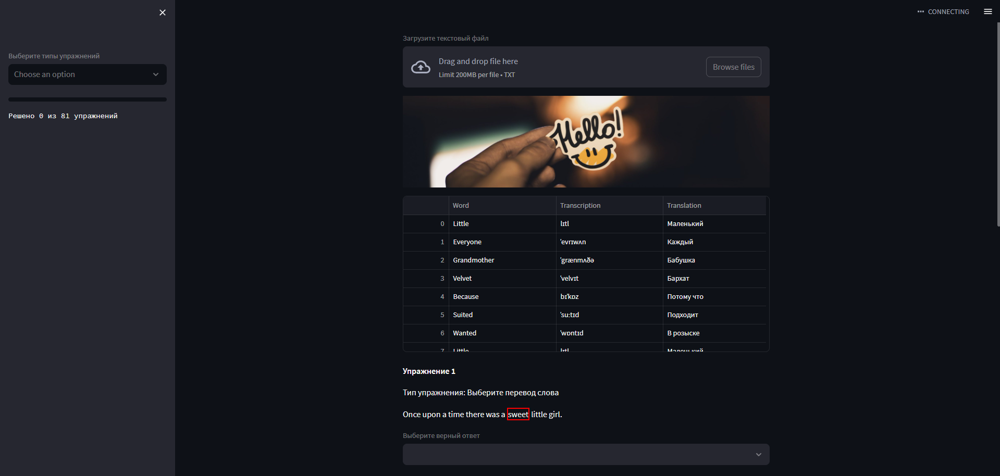
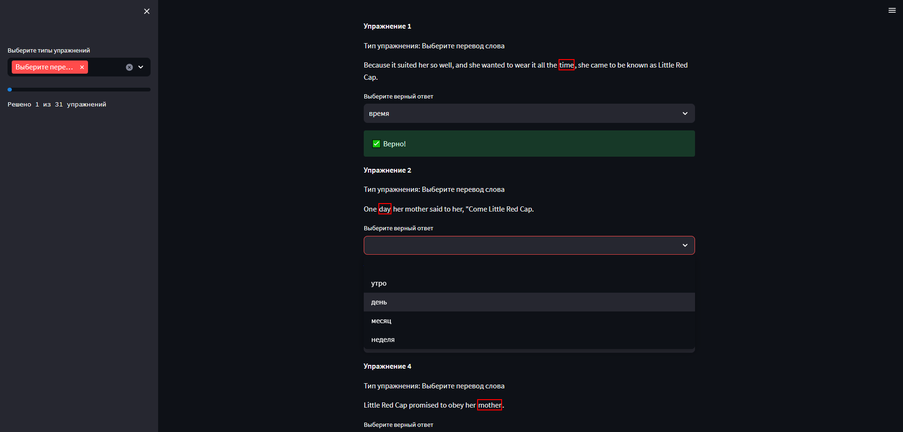

# English Exercise Generator

English Exercise Generator - это приложение Streamlit, которое позволяет генерировать различные типы упражнений по английскому языку. Приложение использует предложения из текстовых файлов и генерирует упражнения на перевод слов, выбор правильной формы глагола и употребление артиклей.

## Запуск по ссылке

https://englishexercisegenerator.streamlit.app/

## Установка и запуск

Чтобы установить и запустить это приложение локально, выполните следующие шаги:

1. Клонируйте этот репозиторий на свой компьютер.
2. Установите необходимые зависимости, используя команду `pip install -r requirements.txt`.
3. Запустите приложение, используя команду `streamlit run streamlit_app.py`.

## Использование

После запуска приложения откройте его в браузере по адресу [http://localhost:8501](http://localhost:8501). На главной странице приложения находятся словарь слов с переводом и транскрипциями и упражнения. На левой панели приложения вы увидите прогресс-бар, строку с количеством решенных упражнений и выпадающее меню для выбора типа упражнения.

Чтобы сгенирировать словарь и упражнения нажмите на кнопку Browse files и выберите текст на английском языке в формате .txt.

## Скриншоты

